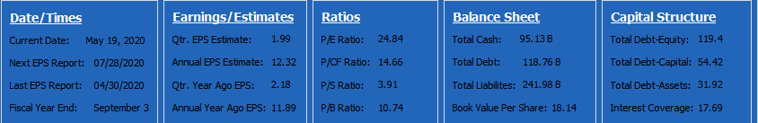

 <table align="center"><tr><td align="center" width="9999">

# C++ Stock Financials Web Scrapper

C++ Web Scrapping tool that makes it easier to grab financials from various stock websites and makes them accessible. It can be used directly with various stock market programs to give you a better idea of how a specific company is doing. It is not limited to any specific website or value.

# Features
- Easy use and easy setup, only two files needed(and also libcurl)
- Works with WSJ, and can be altered to work with various other websites
- Parser can find both doubles/ints and strings.
- Can use the return value to modify the parsed data
- Updates off of the websites data
- A great starting point for an Algorithmic trades



# Installation
- Simply copy and paste the code over into your own files or download the files and add them to your workspace

# How To Use
1.  Input a symbol("AAPL") where symbolSearchStd is, this gives you the address to wsj.
```
pageAddress = "https://www.wsj.com/market-data/quotes/" + symbolSearchedStd + "/financials";
CurlObj webPage(pageAddress);
WebScrapper web = WebScrapper(symbolSearchedStd, webPage.getData());
```

2. Input the data you want to find on the website(in this example its p/e ratio).
```
size_t indexpeRatio = html.find("P/E Ratio ");
peRatio = findNum(html.substr(indexpeRatio, html.length() - indexpeRatio));
```
3. Output the data in the way you see fit(in my case I am using QT Creator and outputting it on a QLabel).
```
ui->peRatio->setNum(web.peRatio);
```


# Notes
- Feel free to update this anyway you see fit as improvements most definitely can be made, this is my first real project I have worked on, changed, and made public. Any advice or errors you see in my code and would like to point out would help me a lot! I hope this helps and if you have any questions feel free to ask me!
</td></tr></table>


